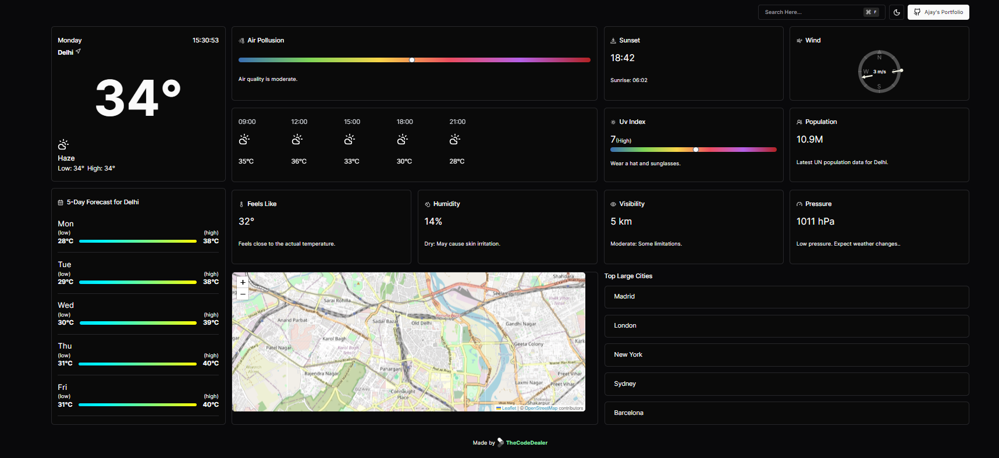

# React-Next-WetherApp




If interested, please solve the below problem and send us the Github link via email at contact@verlynk.com

 
Problem Statement: 
Your main task will be to develop a weather application that retrieves data from a weather API(OpenWeatherMap can be used) and presents current weather information for a specified location. Users should be able to easily search for cities, view current temperature, weather conditions, and other relevant details, with the flexibility to add and monitor multiple cities. 


 
Requirements: 


React Project Setup: Initialize a React project and create essential components for the weather application.


OpenWeatherMap Apis: you can use openWeatherMap Apis for receiving Data.
 
Form Component: Implement a form component enabling users to input city names. Manage input field state and handle weather data fetched from the API. 


Display Weather Information: Show current temperature, weather conditions, and additional relevant data retrieved from the API. 


City Management: Enable users to add multiple cities to their weather dashboard for convenient weather tracking. 


Error Handling: Ensure robust error handling for cases such as invalid city names or failed API requests, displaying appropriate error messages. 

 
Responsiveness: Make the application responsive to varying screen sizes and devices for optimal user experience. 


## Getting Started

To get started with the project, follow these steps:

1. Go to the project directory.
2. Install dependencies by running:
   
   ```bash
   npm install 
3. Run Project by:
   
   ```bash
   npm run dev

  
